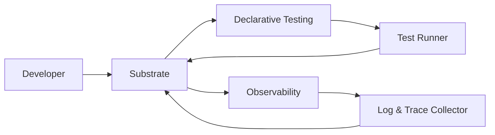

### 1. Introduction

#### 1.1 Problem Statement

Organizations that use microservice architectures or services with many dependencies often lack a consistent and automated end-to-end testing strategy. Their initial development environment is frequently broken, inconsistent with production, and difficult to maintain. Moreover, developers often lack any meaningful local end-to-end testing capabilities. While having different teams responsible for various services accelerates development times, it also impedes the establishment of a maintainable end-to-end local testing solution.

A local end-to-end testing environment is worth having because addressing these challenges can significantly improve the efficiency, reliability, and overall quality of the development process. By developing a unified and maintainable local testing solution, organizations can reduce development cycles, increase confidence in changes working across service boundaries, and decrease the costs associated with debugging and fixing issues that reach production.

#### 1.2 Proposed Solution

`virtual-cluster` manages the startup, initialization, and testing of containerized microservices and their dependencies, such as LocalStack and PostgreSQL, for local testing. `virtual-cluster` will incorporate the following components:

- Substrate: A module to run and manage containerized microservices and their dependencies locally.
- Declarative Testing: A module for creating and executing human-readable tests that describe the expected behavior of the services.
- Observability: A module for collecting logs and OTEL traces, providing insights into the system's performance and health.

These components will be organized into clearly delineated modules within the virtual-cluster project, ensuring a modular and maintainable architecture.

#### 1.3 Scope and Boundaries

The scope of this project includes:

- Developing a substrate to run and manage containerized microservices and their dependencies locally.
- Creating a declarative testing module for service behavior validation.
- Developing an observability module for collecting logs and OTEL traces for debugging purposes.
- Ensuring services are running healthily with sanity tests and health checks.

Out of scope:

- Test data management.
- Test environment management.
- Integration with CI/CD pipelines.
- Scaling beyond local testing on a laptop.

#### 1.4 Stakeholders

The primary stakeholders for this project are:

- Developers working on containerized microservices.

### 2. Background and Context

Organizations developing and maintaining microservices often face challenges in ensuring reliable and efficient end-to-end testing, especially in local environments. Some of the key issues include:

- Inconsistent local testing: Teams may have their own services with varying levels of local integration testing, but they often lack a unified approach to test end-to-end behavior locally. This can lead to longer development cycles and reduced confidence in changes working across service boundaries.

- Unreliable development stages: Local testing environments may not accurately reflect the production environment, leading to discrepancies in behavior and potential issues when deploying to production. However, striking a balance between local testing fidelity and maintenance costs is crucial.

- Ambiguous ownership: When end-to-end testing systems are created, it's often unclear which teams are responsible for maintaining shared testing components. This can lead to difficulties in keeping these components up-to-date and compatible with the evolving needs of the organization.

- Debugging challenges: Debugging test failures in end-to-end systems can be time-consuming and complex, especially when dealing with multiple services and components. An effective observability layer is essential for developers to quickly analyze traces and logs from various components and identify the root cause of failures.

- Cost of undetected bugs: Bugs that reach production can be significantly more challenging and time-consuming to debug and fix, particularly if the organization's production observability is not mature. Ensuring robust local testing can help catch issues early and reduce the overall cost of addressing them.

To address these challenges, it's essential to develop a well-designed system that is easy to modify, update, and maintain. The virtual-cluster project aims to provide a unified solution for local end-to-end testing, focusing on the developer experience and ensuring efficient debugging and observability capabilities.

### 3. Requirements

#### 3.1 Functional Requirements

1. Provide a unified substrate for running and managing containerized microservices and their dependencies locally.
2. Support custom Domain Specific Languages (DSLs) for service configuration, allowing developers to easily define service dependencies, health check endpoints, startup sequences, and other necessary details.
3. Enable developers to write and execute declarative tests that describe the expected behavior of the services, using a human-readable format.
4. Collect logs and OTEL traces from all services and components, making them easily accessible for debugging purposes.
5. Implement health checks and sanity tests to ensure that services are running correctly and are ready for testing.
6. Allow developers to easily add, edit, or remove services and their configurations within the virtual-cluster project.
7. Support integration with existing service repositories, either through Git submodules or cloning, to facilitate interaction with individual services.
8. Test creation: Enable developers to write new tests and declarative test functionality with minimal effort, using a human-readable format.

#### 3.2 Non-Functional Requirements

1. Maintainability: Design the virtual-cluster project with a modular architecture, making it easy for developers to update and maintain the system.
2. Ease of updating: Ensure that adding, editing, or removing services and their configurations is a straightforward process for developers.
3. Debugging: Provide efficient debugging capabilities by collecting logs and OTEL traces and making them easily accessible.
4. Observability: Implement an observability layer that allows developers to quickly analyze traces and logs from various components and identify the root cause of failures.

### 4. High-Level Design

The virtual-cluster project will consist of three main components: the Substrate, the Declarative Testing module, and the Observability module. These components will work together to provide a seamless local testing experience for developers.

#### 4.1 System Architecture

1. **Substrate**: This component is responsible for running and managing containerized microservices and their dependencies locally. It will ensure that the specified versions of services are checked out, run them, and perform health checks and sanity tests to confirm that the services are running correctly.

2. **Declarative Testing**: This module allows developers to write and execute human-readable tests that describe the expected behavior of the services. The tests will interact with the Substrate to perform actions and validate the responses from the services.

3. **Observability**: This component collects logs and OTEL traces from all services and components, making them easily accessible for debugging purposes. It provides insights into the system's performance and health, helping developers identify and resolve issues.

#### 4.2 Example

To illustrate the capabilities of the virtual-cluster system, let's consider a generic example involving multiple services and their interactions:

1. **Service A**: This service exposes APIs X and Y and communicates with a Kafka message broker. API X is responsible for creating a new account, while API Y retrieves account information. When a new account is created, Service A generates a Kafka message with the account details.

2. **Service B**: This service consumes Kafka messages generated by Service A and processes the account information. After processing, Service B communicates with Service C to obtain additional data related to the account.

3. **Service C**: This service provides an API Z that returns additional data based on the input received from Service B. Service C also generates a Kafka message to trigger a notification (e.g., email) for the new account.

4. **Service D**: This service consumes Kafka messages generated by Service C and sends notifications (e.g., emails) to the account holders.

Using the virtual-cluster system, a developer can create a declarative test that covers the following steps:

1. Call API X of Service A to create a new account and ensure a 200 response is received.
2. Verify that the database entry for the new account is created correctly.
3. Check that Service A generates the correct Kafka message with the account details.
4. Confirm that Service B consumes the Kafka message and processes the account information.
5. Ensure that Service B communicates with Service C's API Z to obtain additional data related to the account.
6. Verify that Service C generates a Kafka message to trigger a notification (e.g., email) for the new account.
7. Confirm that Service D consumes the Kafka message and sends the notification (e.g., email) to the account holder.

#### 4.3 Decomposition

1. **Substrate**: Break down the Substrate into sub-components responsible for specific tasks, such as:
   - Service Management: Handles the startup, shutdown, and health checks of services.
   - Dependency Management: Manages the dependencies of services, such as databases and message brokers.
   - Configuration Management: Handles the parsing and validation of service configurations using custom DSLs.

2. **Declarative Testing**: Divide the Declarative Testing module into sub-components, such as:
   - Test Definition: Provides a framework for defining tests using a human-readable format.
   - Test Execution: Handles the execution of tests, interacting with the Substrate and services to perform actions and validate responses.
   - Test Reporting: Generates test reports, summarizing the results and providing insights into the test execution.

3. **Observability**: Split the Observability module into sub-components focused on specific aspects of observability, such as:
   - Log Collection: Collects logs from all services and components.
   - Trace Collection: Gathers OTEL traces for debugging purposes.
   - Monitoring & Alerting: Integrates with monitoring and alerting tools to provide real-time insights into the performance and health of the services.

---

## Solution Details

### Repository Structure

The `virtual-cluster` project is the command-line tool.

Customers will create a config repo e.g. `virtual-cluster-config` that contains the following:

- `.services`: A file listing the services, their repositories, branch/tag/commit, and directory within the repo (or root). This file will utilize a custom ANTLR-based DSL for consistency and ease of use.

Customers will create the following files in each of their service repositories:

- `.vcluster`: A file included in each service's repository containing information such as service dependencies, health check endpoints, startup sequences, and other necessary details. This file will also use a custom ANTLR-based DSL.

### Custom DSLs
The custom DSLs for the `.services` and `.vcluster` files will be created using the ANTLR (ANother Tool for Language Recognition) framework. This will ensure clear semantics and excellent static analysis capabilities. The DSL will be similar to HCL but have a strict lexical grammar to make static analysis and IDE auto-suggestion easier. The DSL must be easy to use, learn, and train for.

### Log and Trace Collection
To provide a seamless developer experience, `virtual-cluster` will collect logs and OTEL traces for efficient debugging. Instead of forwarding logs, the repository will run a local service responsible for collecting and analyzing logs and traces. This will ensure easy access to relevant information for developers.

### Service Interaction
In order to execute the `virtual-cluster`, Git submodules or cloning of the Git repositories for each service will be required. This will enable the repository to manage and interact with the individual services effectively.
